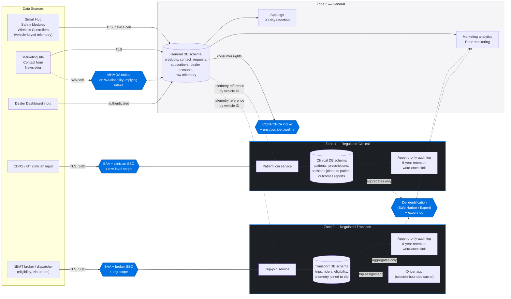

# Segmentation Architecture

This document shows how data flows between the three zones defined in `data-zones.md` and where the boundary controls live. The diagram is the source of truth; the narrative explains the labeled controls.

---

## Diagram

---

## Narrative

### The hub-and-spoke pattern

Raw device telemetry from Smart Hubs, Safety Modules, and Wireless Controllers always lands first in the **General** zone, keyed by vehicle ID. The vehicle ID is not, by itself, PHI. The General-zone record is the single source of truth for the device.

When a clinician needs to view that data alongside a patient, the **patient-join service** in the Regulated-Clinical zone *references* the General-zone record by vehicle ID and writes a patient-join record inside the Clinical zone. The General-zone record is unchanged. The Clinical-zone record is the PHI.

The same pattern applies to NEMT: the **trip-join service** in the Regulated-Transport zone references General-zone telemetry and writes the trip-join inside the Transport zone.

This pattern matters because it means:

- We do not have to declare the entire telemetry pipeline as PHI.
- A breach of the General zone exposes vehicle-keyed telemetry, not patients or riders.
- A clinician or broker losing access does not disturb device operation.

### Boundary controls

| Control | Where it sits | What it enforces |
|---|---|---|
| **BAA + clinician SSO + row-level scope** | At the entrance to Regulated-Clinical | Only authenticated clinicians under a signed BAA reach the patient-join service; row-level policies restrict each clinician to their assigned patients |
| **BAA + broker SSO + org scope** | At the entrance to Regulated-Transport | Same shape, scoped to broker organization and trip ownership |
| **De-identification (Safe Harbor / Expert)** | On any aggregate flowing from a regulated zone back to General analytics | Removes the 18 HIPAA identifiers (or applies expert-determination methodology); each export logged |
| **MHMDA notice** | On the User Funnel intake when the visitor is in WA | Provides the consumer health data notice MHMDA requires before collecting disability-implying data |
| **CCPA/CPRA intake + unsubscribe pipeline** | On the General zone | Honors deletion within 45 days; unsubscribe within 10 business days |
| **Append-only audit logs** | Inside each regulated zone | Every read of a patient or trip record is recorded; logs go to a write-once sink (object-lock storage) so the application cannot rewrite history |
| **Driver-app session-bounded cache** | At the regulated-zone edge facing drivers | Trip details are wiped at end of shift so a lost device does not leak a roster |

### Where third parties sit

| Vendor category | Allowed in General | Allowed in Regulated-Clinical | Allowed in Regulated-Transport | Notes |
|---|---|---|---|---|
| Cloud hosting (Postgres, app runtime, object storage) | Yes | Yes, BAA required | Yes, BAA required | Same provider can host all three zones; logical separation enforced by schema, role, and KMS key |
| Email service (transactional) | Yes | Yes, BAA required | Yes, BAA required | Marketing email stays in General-only |
| Email service (marketing/newsletter) | Yes | No | No | Never include PHI in subject lines, body, or recipient lists |
| Analytics / product telemetry | Yes | Aggregates only via de-identification | Aggregates only via de-identification | No raw IDs leave the zone |
| Error monitoring | Yes | Yes if redaction is enforced and BAA signed | Same | PHI scrubbing on the SDK side |
| LLM / AI providers | Yes for non-PHI content | Only with BAA *and* zero-retention contract terms | Same | Patient or trip context never sent to a non-BAA endpoint |
| Payment processors | Yes (PCI in their scope) | Not applicable | Not applicable | Clinical/Transport billing happens broker-side |
| CRM | Yes | No | No | Sales data is General; do not paste PHI into CRM notes |

### Implementation notes for engineering

- **One physical cluster, three schemas, three roles.** The simplest implementation is one Postgres cluster with `general`, `clinical`, and `transport` schemas, three database roles, and three KMS key references. This satisfies the policy boundary without operational sprawl.
- **The patient-join and trip-join tables hold the only foreign keys that cross zones.** Those keys are vehicle IDs, not patient or rider identifiers, so even the join key does not leak a person.
- **Audit logs ship out of the application.** The application can write append-only entries; it cannot delete or amend them. Use object-lock storage or an external WORM log service.
- **Background jobs respect zone roles.** A worker that processes telemetry runs as the General role and cannot read the Clinical or Transport schemas. A worker that compiles a Justification Packet runs as the Clinical role and cannot write to General.
- **Logs and crash reports are scrubbed at the SDK.** PHI never reaches a non-BAA log destination, even by accident. Field-level allow-lists are safer than deny-lists.
- **Today's `shared/schema.ts` is General-only.** `products`, `contact_requests`, and `subscribers` are all General. The Clinical and Transport schemas do not yet exist in code; they are introduced when the corresponding products ship.
